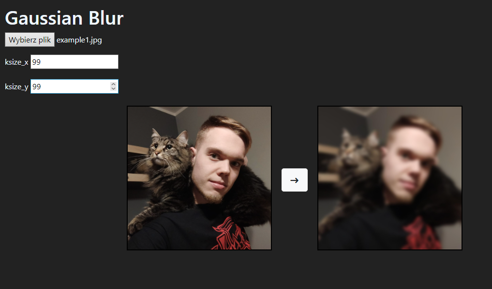
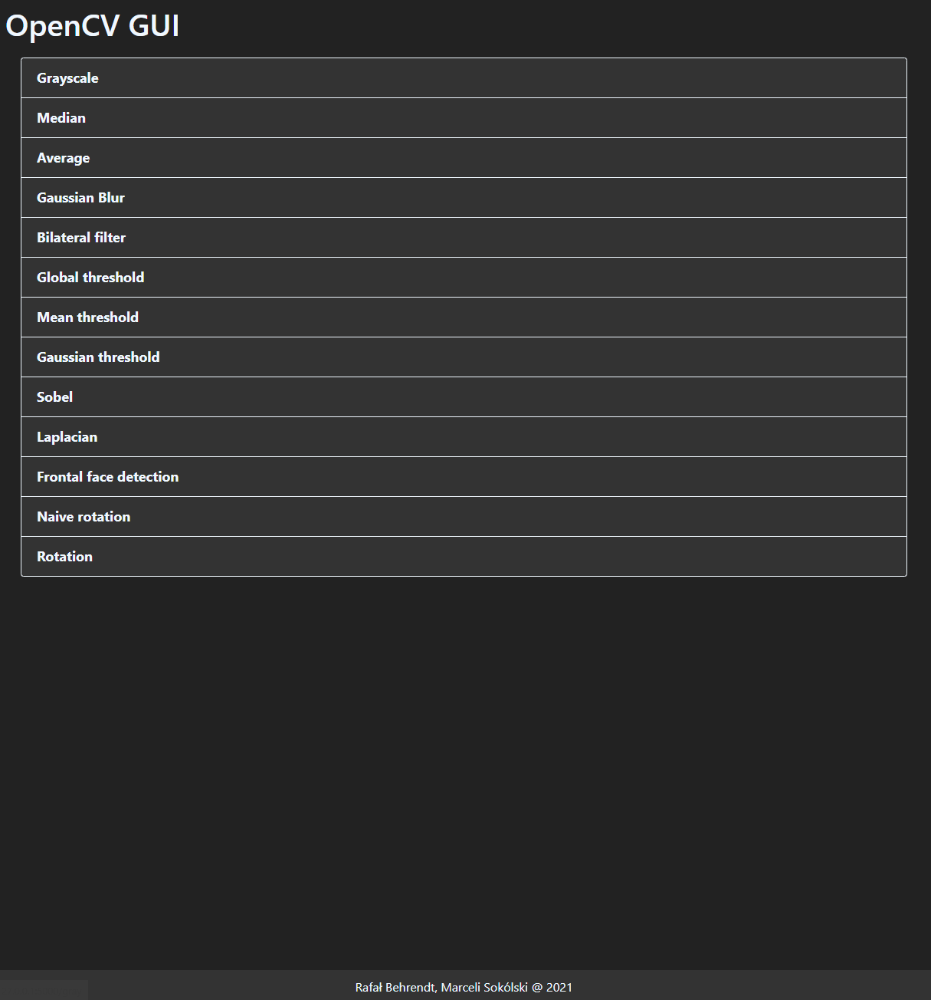
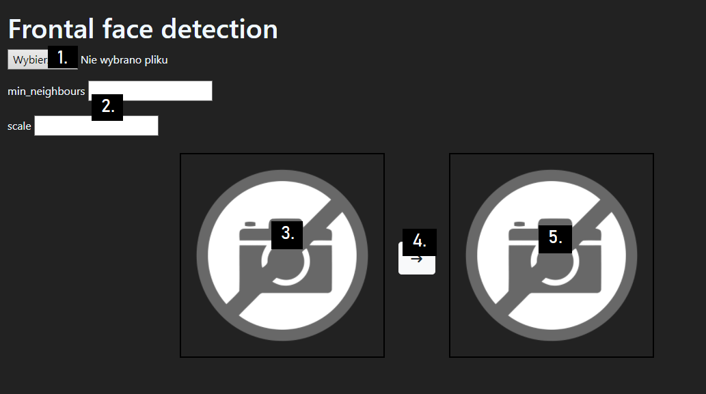
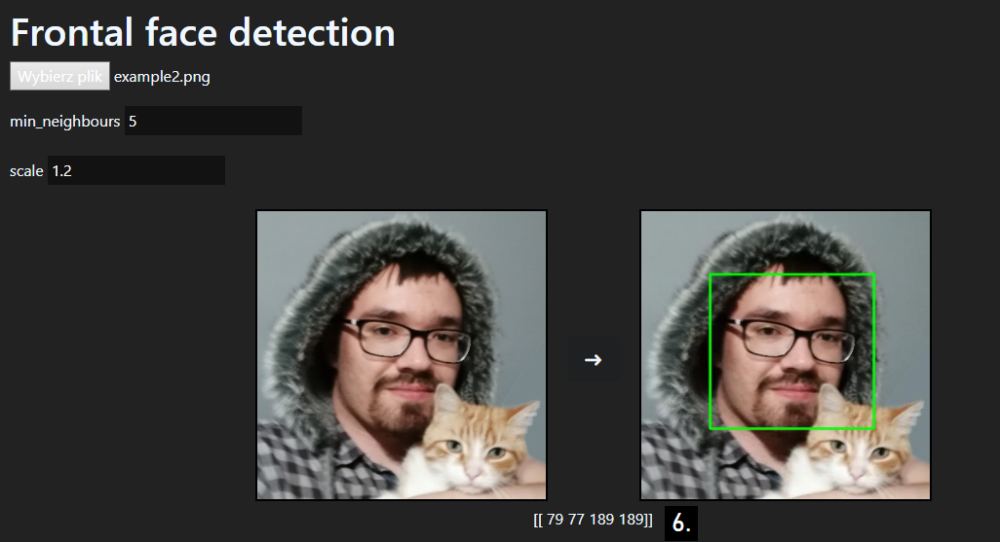

# OpenCV2 imageproc GUI
[1. Description](home#1-description)  
[2. Sources](home#2-sources)  
[3. Example data](home#3-example-data)  
[4. Executing method](home#4-executing-method)  
[5. Run container](home#5-run-container)  

## 1. Description

OpenCV2 is open source library that implements countless AI solutions. Its module imageproc is written precisely to process images. Service provides possibility to simply use image processing methods. For each method image and data needs to be loaded. Simple GUI allows user to send data to server and recieve its response through REST API. Processed image along with original one is presented for user in internet browser. Each image is processed immidiately after receiving, no redundant data is saved on server. Each method has its REST API endpoint with GET method for loading a dedicated site and POST method for processing image. 

Methods attached to this project with their endpoints:

* Grayscale - /grayscale
* Median - /median
* Average - /average
* Gaussian Blur - /gauss
* Bilateral filter - /bilateral
* Global threshold - /thresh/global
* Mean threshold - /thresh/mean
* Gaussian threshold - /thresh/gauss
* Sobel - /sobel
* Laplacian - /laplacian
* Frontal face detection - /frontal
* Naive rotation - /roation/naive
* Rotation - /rotation

Frontal face deteciton works with haarcascade. It was downloaded from [OpenCV repository](https://github.com/opencv/opencv/tree/master/data/haarcascades) It also returns face coordinates on image.

## 2. Sources

1. Alberto Fernandez Villan Mastering OpenCV 4 with Python  
2. [OpenCV documentation](https://docs.opencv.org/3.4/d7/da8/tutorial_table_of_content_imgproc.html)

## 3. Example data

### Gaussian blur example data

ksize_x: 99  
ksize_y: 99

### Frontal face example data

min-neighbours: 5  
scale: 1.2

For gaussian blur an image along with ksize_x and ksize_y needs to be provided.

## 4. Executing method

Main page provdies menu with methods to choose from:  

There user can choose method to execute. Next he needs to provide image and data if necessary. Image can be provided with button 1 and appears on field 3. Additional data can be provided in fields 2 and can vary, depending on method. Button 4 sends data to server and retrives its response. Result is displayed on field 5 and any additional data is displayed below images (field 6).

## 5. Run container
Using docker CLI the image can be run by using following command:

`docker run`
